# Business Extractor (Google Maps → PhantomBuster → Apify)

A Streamlit app (`test.py`) that helps generate lead lists by:

- **Step 1**: finding businesses near a location via **Google Places Nearby Search**
- **Step 1b**: enriching each business with **phone + website** (Places Details) and best-effort **email extraction** (website scraping)
- **Optional Step 2**: sending the enriched CSV (filtered to rows with a Website) to **PhantomBuster**
- **Optional Step 3**: taking LinkedIn **company URLs** from Phantom results and running an **Apify Actor** to fetch people, then exporting a people CSV

## Current features (as implemented in `test.py`)

- **Google Places search**
  - Location input: **Google Maps URL** (extracts `@lat,lon`) or **manual coordinates**
  - Keyword/industry search
  - Radius: **100m → 50km**
  - Pagination support (collects multiple pages)
- **Enrichment**
  - Phone + Website via **Place Details**
  - Email extraction by scanning website HTML with a simple regex
  - Live progress updates in the UI; table refreshes periodically to reduce flicker
- **UI**
  - Map view via **PyDeck** + data table
  - CSV export of the enriched businesses
- **PhantomBuster (optional)**
  - Uploads the “companies with website” CSV to `tmpfiles.org`
  - Launches a PhantomBuster agent (Agent ID is hard-coded in the app)
  - Downloads `result.csv` from PhantomBuster S3 and extracts LinkedIn company URLs
- **Apify (optional)**
  - Runs an Apify Actor (default Actor ID in the UI) using the extracted LinkedIn company URLs
  - Shows results in a table and exports a CSV

## Requirements

- **Python 3.9+** recommended
- A **Google Maps API Key** with:
  - **Places API** enabled (Nearby Search + Place Details)
- Optional integrations:
  - **PhantomBuster API Key** (if using Step 2)
  - **Apify token** (if using Step 3)

## Installation

From this folder:

```bash
python -m venv .venv
source .venv/bin/activate
pip install -r requirements.txt
```

## Run

```bash
streamlit run test.py
```

Open the app (Streamlit will print the local URL, usually `http://localhost:8501`).

## How to use (workflow)

## Logic flow (Mermaid)

```mermaid
flowchart TD
  %% NOTE: This is the app's logic/data flow (not Streamlit UI rendering).

  Start([Start]) --> Inputs

  Inputs["Inputs\n- google_api_key\n- industry (keyword)\n- location: (lat,lon) from URL OR manual\n- radius\n- (optional) pb_enabled + pb_api_key + pb_market + pb_number_lines\n- (optional) apify_enabled + apify_token/env + apify_actor_id + max_items + profile_mode"] --> Validate

  Validate{Valid inputs?} -->|no| StopInvalid([Stop: show validation error])
  Validate -->|yes| NearbySearch

  %% --- Step 1: Google Places search (Nearby Search + pagination)
  NearbySearch["fetch_places(api_key, (lat,lon), radius, keyword)\nGET /place/nearbysearch\naccumulate results[]"] --> HasNext{next_page_token?}
  HasNext -->|yes| WaitToken["sleep(2)\n(set params.pagetoken)"] --> NearbySearch
  HasNext -->|no| ToDF

  ToDF["process_basic_results(results)\n-> df businesses\nColumns:\nName, Rating, Address, lat, lon, Place ID,\nPhone='Pending...', Website='Pending...', Email='Pending...'"] --> EnrichLoop

  %% --- Step 1b: Enrichment loop (Place Details + website email scraping)
  EnrichLoop["enrich_data(df)\nfor each row (Place ID):"] --> Details
  Details["get_place_details(place_id)\nGET /place/details\nfields=formatted_phone_number,website\n-> phone, website"] --> Email
  Email["extract_email_from_website(website)\nGET website HTML\nregex emails\nfilter likely assets\n-> up to 3 deduped emails"] --> UpdateRow
  UpdateRow["df.at[i,'Phone']=phone\n df.at[i,'Website']=website\n df.at[i,'Email']=email"] --> MoreRows{More rows?}
  MoreRows -->|yes| Details
  MoreRows -->|no| SaveEnriched

  SaveEnriched["Store df_enriched in session_state\nEnable CSV export"] --> PBBranch

  %% --- Optional Step 2: PhantomBuster
  PBBranch{pb_enabled AND user clicks Launch Phantom?} -->|no| ApifyBranch
  PBBranch -->|yes| FilterWebsite

  FilterWebsite["Filter df_enriched -> df_with_website\nWebsite not empty / not 'Pending...'"] --> HasWeb{Any rows?}
  HasWeb -->|no| PBStop([Stop: no companies with website])
  HasWeb -->|yes| UploadTmp

  UploadTmp["Upload df_with_website CSV bytes to tmpfiles.org\n-> spreadsheetUrl (download URL)"] --> PBLaunch
  PBLaunch["PhantomBusterClient.launch_agent(agent_id, argument)\nargument={csvName:'result', market, spreadsheetUrl, numberOfLinesToProcess}\n-> containerId"] --> PBWait
  PBWait["wait_for_container(containerId)\npoll /containers/fetch until finished/failed/timeout"] --> PBMeta
  PBMeta["fetch_agent(agent_id)\n-> orgS3Folder, s3Folder"] --> PBDownload
  PBDownload["Build S3 URL for result.csv\nDownload bytes\nParse as DataFrame"] --> PBFilter
  PBFilter["_filter_pb_results_to_current_run(df_pb, df_with_website)\nMatch by domain (preferred) and name (fallback)"] --> ExtractLinkedIn
  ExtractLinkedIn["_extract_linkedin_company_urls(df_pb_filtered)\nTraverse cells for linkedin.com/company URLs\n-> linkedin_company_urls[]"] --> StoreLinkedIn
  StoreLinkedIn["Store:\n- df_pb_results_raw\n- df_pb_results (filtered)\n- linkedin_company_urls"] --> ApifyBranch

  %% --- Optional Step 3: Apify People Scraper
  ApifyBranch{apify_enabled AND user clicks Run Apify?} -->|no| End([End])
  ApifyBranch -->|yes| BuildCompanies

  BuildCompanies["companies = linkedin_company_urls\nnormalize + dedupe + validate"] --> HasCompanies{Any company URLs?}
  HasCompanies -->|no| ApifyStop([Stop: no LinkedIn company URLs])
  HasCompanies -->|yes| ApifyRun

  ApifyRun["_run_apify_people_scraper(token, actor_id, companies)\nApifyClient.actor(actor_id).call(run_input)\nIterate dataset items\n-> people items[]"] --> PeopleDF
  PeopleDF["df_people = DataFrame(items)\nStore df_people\nEnable People CSV export"] --> End
```



### Step 1: Google Maps businesses + enrichment

1. Enter **Google Maps API Key**
2. Pick **Industry / Keyword**
3. Pick location input method:
   - **Google Maps URL**: paste a URL containing `@lat,lon` (short URLs are expanded)
   - **Enter Coordinates**: type latitude/longitude
4. Set **Search Radius**
5. Click **Find Businesses**

The app will:

- fetch businesses (Nearby Search)
- enrich each row (Place Details + optional email scraping)
- allow **Export to CSV**

### Optional Step 2: PhantomBuster

1. In the sidebar, enable **PhantomBuster**
2. Enter your **PhantomBuster API Key**
3. Click **Launch Phantom**

Notes:

- The app sends only companies where `Website` is present (not empty / not “Pending…”).
- The app expects Phantom results to be available as **`result.csv`** in the agent’s S3 folder, then filters those results back to the current run and extracts **LinkedIn company URLs**.

### Optional Step 3: Apify (people from LinkedIn company URLs)

1. In the sidebar, enable **Apify**
2. Provide an Apify token (recommended via env var `APIFY_TOKEN`, UI field is fallback)
3. Click **Run Apify (People)**

Output:

- a table of people results
- a downloadable **people CSV**

## Configuration / environment variables

- **`APIFY_TOKEN`**: recommended way to provide the Apify token for Step 3.

## Data + compliance notes

- **Google Maps Platform ToS**: ensure your usage (storage/caching/redistribution) complies with Google’s terms.
- **Scraping**: email extraction is best-effort HTML scanning and may violate site policies; respect `robots.txt` / local laws and do not use for spam.
- **Secrets**: do not commit API keys. Prefer environment variables where possible.

## Project files

- `test.py`: the Streamlit app (Step 1 + optional Step 2/3)
- `requirements.txt`: dependencies
